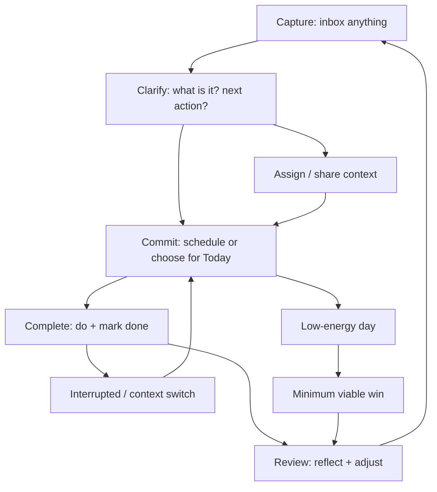
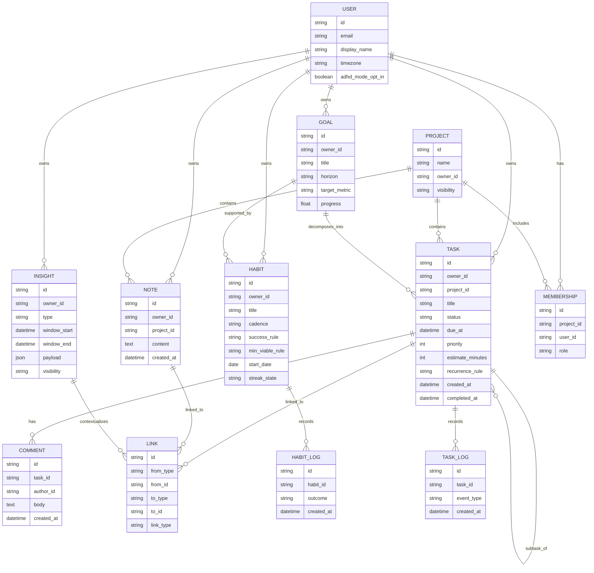

# Project Praxis: Problem–Solution Definition and Core Model for a Life OS Web App

## Executive Summary

Project Praxis is best positioned as a **daily execution system** (tasks + habits + goals + review) that optionally supports (1) collaborative coordination for households/teams and (2) non-invasive “insight overlays” (astrology/human design/numerology) that **augment** planning without becoming the product’s primary loop. This framing intentionally avoids the failure modes seen in many productivity tools: either being too opinionated (users must adopt a philosophy) or too unbounded (users must build a system first). citeturn2search3turn2search14turn3search7turn7search2

The most precise underlying problem to solve is not “task management.” It is: **turning intentions into completed actions reliably—across interruptions, fluctuating energy, and competing priorities—while keeping the system cognitively light enough to return to every day**. This is especially critical for ADHD users, where time management, organization, procrastination, distractibility, and difficulty sustaining effort are common and directly impair follow-through. citeturn1search0turn1search5turn14search0turn14search10

A rigorous “core-before-features” approach yields three non-negotiables:

1) A universal **core loop**: *Capture → Clarify → Commit → Complete → Review* optimized for “fast re-entry” after disruptions. (Task switching costs are real; the system must support recovery.) citeturn0search7turn2search14turn14search10  
2) A minimal **object model** where tasks/habits/goals/notes/projects/insights are first-class, relational, and instrumentable. (Relational models reduce duplication and support multiple views without forcing users to rebuild information.) citeturn2search3turn3search15turn7search8  
3) Behavioral design that privileges **autonomy and low-friction progress** (micro-commitments, graded streaks, implementation intentions), because purely extrinsic reward structures can backfire and streak mechanics can tip into compulsion if misused. citeturn0search1turn11search14turn12search2turn2news39turn13search0

A recommended North Star Metric for early validation is: **Weekly Praxis Completion Rate** = % of active users who (a) plan a day at least 3 times/week and (b) complete at least 1 priority task per planned day (or log a “minimum viable win” on low-energy days). This focuses on customer value (consistent execution + reflection), not vanity usage. citeturn7search2turn14search10turn0search0

## Evidence Base and Benchmark Signals

This report prioritizes (1) peer-reviewed behavioral science, ADHD treatment literature, and cognitive psychology; (2) primary product documentation for well-known tools; and (3) reputable UX/product analytics guidance.

Behavioral and cognitive foundations used here include: (a) habit automaticity formation dynamics, which tend to asymptote over time and vary by behavior and person; (b) “if–then” implementation intentions to reduce initiation friction; (c) motivation theory showing the importance of autonomy/competence/relatedness; (d) task switching costs and recovery; (e) loss aversion and goal-gradient effects that make streaks powerful—and potentially harmful without guardrails. citeturn0search0turn0search1turn0search2turn0search7turn13search0turn13search2

Benchmarks referenced as “design signals” (not as targets to replicate):

- entity["company","Todoist","task management app"]: strong capture mechanics (natural language, recurring tasks), filters, and an optional productivity layer (Karma). citeturn2search8turn2search14turn3search7  
- entity["company","Duolingo","language learning app"]: streak as a clear daily commitment mechanism (with documented habit framing). citeturn2search2turn2search16  
- entity["company","Habitica","gamified task manager"]: fully gamified productivity loop (with evidence that gamification can also produce counterproductive patterns). citeturn5search7turn5search18turn12search3  
- entity["company","Notion","workspace productivity app"]: relational data model enabling multiple views; also a warning about unbounded customization overhead if “build your own system” becomes a prerequisite. citeturn2search3turn2search0  
- entity["company","Obsidian","markdown knowledge base app"] and entity["company","Roam Research","networked thought notes app"]: graph/networked thought paradigms pointing to the value of linked knowledge, while highlighting that “thinking space” features must not displace execution. citeturn3search0turn3search21  
- entity["company","tldraw","infinite canvas sdk"]: a proven “freeform surface” primitive (whiteboard/infinite canvas) that can be made secondary to the core loop. citeturn3search2turn3search6

image_group{"layout":"carousel","aspect_ratio":"16:9","query":["Todoist app productivity view karma","Duolingo streak flame icon UI","Habitica tasks habits dailies to-dos rewards UI","tldraw infinite canvas whiteboard UI"],"num_per_query":1}

## Precise Problem Statements and User Segments

### Problem statements

A rigorous problem definition for Project Praxis should be **multi-layered**: the “same” product must solve different bottlenecks for different segments, while preserving a single coherent core.

**Problem 1: Intent-to-action breakdown**  
People reliably generate intentions (tasks/goals/habits), but execution fails due to (a) unclear next actions, (b) poor time estimation and prioritization, (c) interruptions, (d) low energy, and (e) lack of reflective feedback loops. Task switching research supports that shifting attention and rules carries measurable costs; a system must reduce the overhead of “getting back on track.” citeturn0search7turn14search10

**Problem 2: Cognitive overload of the “system itself”**  
Many tools force users to (a) learn a philosophy; (b) build a database; or (c) maintain complex structures. This creates tool fatigue: the organizational system becomes another obligation. Relational flexibility (as in database relations/rollups) enables power, but also increases the risk that users must “engineer their life” before they can live it. citeturn2search3turn2search0

**Problem 3: Motivation volatility and brittle streaks**  
Streaks and progress systems are powerful because they leverage loss aversion and goal-gradient dynamics, but they can also become anxiety-inducing or compulsive if “all-or-nothing” mechanics dominate user identity. This risk is documented both in general reporting about streak culture and in foundational behavioral economics research. citeturn2news39turn13search0turn13search2

**Problem 4: ADHD-specific execution barriers**  
Adults with ADHD often report difficulty with organization, procrastination, planning, time management, sustaining attention, and remembering daily tasks—precisely the “execution pipeline” the app targets. Evidence-based psychosocial approaches (including CBT for adult ADHD) explicitly target time management, organization, prioritization, scheduling, and coping with distraction/procrastination. citeturn1search0turn14search0turn14search3turn14search10

**Problem 5: Coordination overhead in households and small teams**  
Shared responsibilities fail not because people “don’t care,” but because assignment clarity, due-date interpretation, and accountability are ambiguous—plus permissions and access control bugs can be catastrophic in collaborative systems. Broken access control remains a top web app risk category, making collaboration both high-value and high-risk to ship without rigor. citeturn6search1turn6search5

**Problem 6: Esoteric tools are fragmented from daily planning**  
A segment wants astrology/human design/numerology as reflective tools, but existing experiences are often content-heavy and repetitive rather than operationally integrated into daily decisions. (Treat this as a product hypothesis derived from stakeholder observation, not as a proven market fact.) The integration opportunity is to make insights **action-adjacent** while keeping them strictly optional. citeturn9search5turn10search4

### User segments and what “success” means for each

**ADHD solo user** (primary segment)  
Success = easy re-entry after disruption; “minimum viable day” completion; reduced overwhelm; fewer forgotten obligations. Clinical descriptions of adult ADHD highlight disorganization, distractibility, procrastination, and time management problems, making these explicit design targets. citeturn1search0turn1search5turn14search10

**Neurotypical solo user**  
Success = faster capture + confident prioritization; consistent habit adoption; clearer goals-to-actions mapping; satisfying progress signals without obsession. Habit formation dynamics indicate consistency matters but varies by person and behavior. citeturn0search0turn0search12

**Household manager**  
Success = shared visibility; low-conflict assignment and reminders; “who’s doing what” clarity; recurring household checklists. Recurring scheduling and saved views/filters are proven primitives in mainstream task tools. citeturn2search8turn2search14

**Small team lead** (teams 2–20; lightweight coordination)  
Success = predictable weekly execution; quick delegation; simple review; minimal admin overhead; ability to use projects for shared outcomes without becoming full PM software. Relational linking between tasks and projects is a documented pattern in database-driven tools. citeturn2search3turn2search0

**Power user** (systems thinker)  
Success = custom views, filters, shortcuts, automation hooks, data export, and a graph/canvas for thinking—without breaking the default experience. Filters and productivity dashboards (like Karma) illustrate how optional power layers can exist without trapping all users. citeturn2search14turn3search7turn3search3

**Esoteric-curious user**  
Success = insights that feel personal and operational (timed nudges, reflection prompts, planning suggestions), with strict opt-in and privacy controls; no generic horoscope walls. Human Design and astrology systems commonly rely on birth data; numerology frequently uses birth date and/or name, raising privacy considerations. citeturn9search5turn9search7turn10search4turn10search2

## Product Thesis, Mission, North Star Metrics, and Success Criteria

### Core product thesis

**Thesis:** Project Praxis is a **daily execution operating system** that transforms intention into completion through a lightweight loop of capture, clarification, commitment, completion, and review—supported by evidence-based behavior design and optional overlays (collaboration, esoteric insights, ambient gamification) that never replace the core loop.

This thesis is consistent with the behavioral principle that when a behavior doesn’t occur, at least one of motivation, ability, or prompt is missing—so the product must systematically address these bottlenecks across contexts (especially low ability/low energy states). citeturn11search14turn11search0

### Single-sentence mission

**Mission:** *Help people reliably do what matters today—through reflective action—without requiring them to build or believe in a system first.*

This explicitly protects against “tool-as-a-project” overload while preserving the Praxis concept of action + reflection. Implementation intentions (“if situation X, then do Y”) support this by offloading initiation to situational cues rather than willpower. citeturn0search1turn0search5

### Desired outcomes and North Star metrics

A North Star Metric should capture **user value**, not mere activity. A strong starting candidate:

**North Star Metric (NSM): Weekly Praxis Completion Rate (WPCR)**  
% of active users who, within a rolling week:
- perform **≥3 planning moments** (Commit), and  
- achieve **≥3 “wins”** (Complete), where a win is either (a) completing a priority task or (b) completing a minimum-viable habit version on a low-energy day, and  
- perform **≥1 review** (Review).

North Star guidance emphasizes selecting a metric that best captures value delivered to customers, not a vanity counter. citeturn7search2turn7search17

Secondary outcomes (supporting metrics), chosen to reflect the execution pipeline:

- **Activation:** first “Today Plan” created within 24 hours of signup. citeturn7search11turn14search10  
- **Engagement quality:** median “time-to-capture” (fast inbox entry) and “time-to-clarify” (turn inbox item into scheduled action). (This maps to reducing friction and improving ability.) citeturn11search14turn2search11  
- **Retention:** D7/D30 retention and weekly cohort retention by segment (ADHD self-identification toggle, solo vs shared workspace). citeturn7search14turn7search10  
- **Completion integrity:** percentage of completed items that were created ≥24h earlier (a proxy to discourage “make fake tasks just to feel productive”). (This is a gamification guardrail.) citeturn13search2

### Success criteria

Because constraints (budget/team/timeline) are unspecified, success criteria should be staged:

- **MVP success:** demonstrate repeat weekly use driven by planning + completion, not novelty browsing (WPCR shows a meaningful baseline). citeturn7search2turn7search10  
- **V1 success:** prove collaboration without conflict escalation (shared projects used weekly; low rate of assignment disputes; minimal permission incidents). Access-control rigor matters early because it’s a dominant web app risk category. citeturn6search1turn6search5  
- **V2 success:** optional modules increase retention for the segments that want them without harming baseline retention for those who don’t (measured via feature adoption cohorts). citeturn7search10turn7search8

## Core Loops, Minimal Object Model, and User Journeys

### Core loop and secondary loops

The “Praxis loop” should be explicit in UI, data model, and analytics:

This loop design directly addresses task switching costs by building a “re-entry path” that returns users to commitment rather than dumping them back into an unstructured backlog. citeturn0search7turn14search10

Secondary loops that must not replace the core:

- **Habit loop:** cue → routine → reward; expressed product-wise as scheduled habit + streak/progress + reflection. Habit automaticity growth is non-linear; the product should expect plateaus and support continued repetition without shame. citeturn0search0turn0search12turn2search16  
- **Goal loop:** define outcome → break into milestones → generate tasks/habits → review progress. Implementation intentions help bridge “knowing” to “doing.” citeturn0search1turn0search5  
- **Collaboration loop:** propose → assign → confirm → complete → review; requires auditability and clear ownership to prevent conflict spirals. citeturn6search1turn6search5

### Minimal object model and required attributes

Project Praxis needs a minimal set of objects that are (a) relational and (b) instrumentable. The model below is intentionally smaller than “everything apps,” but powerful enough to support multiple views and optional overlays. Relational linking is a known enabler of “Tasks ↔ Projects” patterns. citeturn2search3turn2search0

**Task (core atomic unit)**
- Required: id, title, status (inbox/todo/doing/done), created_at, owner_id  
- Needed early: due_at (date or datetime), priority, estimate (optional), context/tags, recurrence_rule (optional) citeturn2search8turn2search11turn14search10

**Habit (repeating behavior with flexible success criteria)**
- Required: id, title, cadence (daily/weekly/custom), success_rule (binary/quantitative), start_date, owner_id  
- Needed early: streak_state, “minimum viable” definition, skip/vacation mode for compassion + realism (streak systems can become unhealthy otherwise). citeturn2news39turn0search0turn3search7

**Goal (outcome)**
- Required: id, title, target (metric or milestone), horizon (e.g., 2 weeks / 3 months), owner_id  
- Needed early: linked_tasks/habits, progress computation rule (manual or derived) citeturn0search1turn2search3

**Note (thinking space / knowledge capture)**
- Required: id, content, created_at, owner_id  
- Needed early: links to tasks/goals/projects; optional graph/canvas references (graph paradigms show value in browsing connections, but must remain subordinate to execution). citeturn3search0turn3search21

**Project (shared container)**
- Required: id, title, members, role/permission scheme, owner_id  
- Needed early: shared tasks; simple statuses; minimal activity log citeturn2search3turn6search1

**Insight (overlay object, always optional)**
- Required: id, type (astrology/human_design/numerology/other), applicable_window (date/time span), payload (structured), visibility (private/shared), owner_id  
- Needed early: links to “Day plan” and optionally to tasks/habits/goals (never required for core completion). citeturn9search5turn10search4turn6search0

### Entity-relationship diagram

This structure supports (1) multiple views without duplicating data (a key relational database advantage) and (2) analytics instrumentation through explicit log/event tables. citeturn2search3turn7search8turn3search15

### User journeys with critical edge cases

**Journey: Capture → Clarify → Commit → Complete → Review**  
This is the default across segments; differences are in friction, prompts, and collaboration mechanics.

- **Capture:** must be near-zero friction, because lowering “ability cost” increases behavior likelihood (behavior model). Natural language task entry and fast capture are proven primitives in task tools. citeturn11search14turn2search11turn2search8  
- **Clarify:** must convert vague intent into next action and context. Implementation intentions (“if X then Y”) can be productized as “When/Where/Trigger” fields to reduce initiation latency. citeturn0search1turn0search5  
- **Commit:** select small set for Today/This week. ADHD guidance emphasizes planners and structured planning sessions, including “plan of attack” for the day. citeturn14search10turn14search6  
- **Complete:** mark done; record reality vs plan; support interruptions. Task switching evidence implies that “resume cues” and simplified re-entry matter. citeturn0search7turn0search3  
- **Review:** short daily review + weekly review. This is where “reflection” becomes operational, matching Praxis as enacted learning. ADHD-oriented planning materials emphasize deliberate planning/review sessions. citeturn14search10turn14search0

Edge cases that must be explicitly designed:

- **Interruptions and context collapse:** user loses thread mid-task → system should re-surface “current commitment” and last 3 actions with minimal cognitive load. Task switching costs support this as a real cognitive tax. citeturn0search7turn0search3  
- **ADHD initiation failure:** user knows the task but cannot start → emphasize micro-commitments (2-minute version), prompts, and “if–then start scripts.” CBT for adult ADHD explicitly targets initiating, scheduling, tracking, and coping with distraction/procrastination. citeturn14search0turn0search1turn11search14  
- **Collaborative conflicts:** two people change priorities; assignment unclear; resentment risk → require explicit owner, due date semantics, and lightweight confirmation. Security-wise, collaboration also raises authorization risks; role/permission correctness becomes core quality. citeturn6search1turn6search5  
- **Low-energy days:** user cannot “perform” but must preserve continuity → “minimum viable win” (tiny habit, 1 priority) and compassionate streak logic reduce all-or-nothing shame spirals. Streak obsession risks are widely discussed, and loss aversion explains why brittle streaks can become coercive. citeturn2news39turn13search0turn0search0

## Prioritization, MVP Scope, Anti-Features, Behavioral Design, and Optional Overlays

### Prioritization framework

Use a two-axis score for features:

1) **Core-loop lift**: does this measurably improve Capture/Clarify/Commit/Complete/Review?  
2) **Irreversibility risk**: does this lock architecture/UI into complexity (permissions, customization models, data schemas)?

Then apply a third gating rule: **Segment breadth** (ADHD + neurotypical + household/team) unless it is explicitly an optional module.

This is consistent with North Star thinking: prioritize what drives value delivery and retention, not superficial engagement. citeturn7search2turn7search10

### Concise prioritized MVP vs V1 vs V2 table

| Priority | MVP (prove the core loop) | V1 (strengthen real use) | V2 (modules & expansion) |
|---|---|---|---|
| P0 | Fast Inbox capture (mobile-first), basic task fields, Today plan | Collaboration basics: shared projects, assignments, comments | Realtime co-editing / advanced collaboration |
| P0 | Scheduling + recurring tasks, lightweight priorities | Advanced views/filters and saved “focus modes” | Automation rules / scripting layer |
| P0 | Habit tracking with minimum viable option + humane streaks | Goal-to-task/habit linking + progress rollups | Multi-goal programs / templates marketplace |
| P0 | Daily & weekly review prompts + reflection notes | Audit/history (undo, activity feed) | AI-assisted reflection & planning (optional) |
| P1 | Notes linked to tasks/goals/projects (no full doc system) | Canvas/whiteboard as secondary view referencing objects | Advanced mind-map/graph exploration |
| P1 | Basic analytics instrumentation (events, funnels, retention) | Segment dashboards + cohort analysis | Experimentation (A/B testing) system |
| P2 | Minimal idle companion (cosmetic, off by default) | Expanded companion progression tied to consistency (not volume) | Seasonal content / deeper game loops (still optional) |
| P2 | Esoteric “Insights” object model + opt-in onboarding | Astrology/human design/numerology overlays + privacy controls | Additional systems (biorhythm or others) if truly demanded |

Rationale anchors:
- Recurrence, filters, and optional productivity layers are validated primitives in mainstream task apps. citeturn2search8turn2search14turn3search7  
- Streak/habit mechanics can build behavior but require guardrails to avoid compulsion and reward backfire effects. citeturn2search16turn12search2turn2news39turn13search0  
- Gamification can also produce counterproductive behavior, evidenced in research on gamified task managers. citeturn12search3turn12search0

### MVP scope rationale

**MVP must prove** that users return weekly because (1) planning is easier, (2) completion is more consistent, and (3) review changes tomorrow’s plan. Habit formation research implies sustained repetition matters, but variability and plateauing are expected; therefore MVP must support continuity rather than “perfect streaks.” citeturn0search0turn0search12turn2news39

**Collaboration is V1, not MVP**, unless your primary wedge market is households/teams from day one. Collaboration introduces disproportionate irreversibility risk due to permissions, access control, and conflict recovery. citeturn6search1turn6search5

### Anti-features and scope-guardrails

To prevent “everything app” collapse, define explicit anti-features:

- **No mandatory philosophy onboarding** (“choose PARA/GTD/XYZ”)—tooling must be usable in <5 minutes.  
- **No fully general document/wiki system** in early stages (avoid turning execution OS into an authoring platform).  
- **No heavy gamification as primary loop** (avoid making users optimize the game instead of life). Counterproductive gamification effects are documented, and extrinsic rewards can undermine intrinsic motivation depending on contingency/type. citeturn12search3turn12search2turn12search6  
- **No paywalling core execution** (capture, plan, complete, review) using manipulative subscription patterns. The FTC has documented deceptive “dark pattern” tactics that trick users into purchases or data surrender. citeturn6search2turn6search10  
- **No infinite customization-first posture** where users must build databases and relations before they can act (the tool becomes homework). Relational systems are powerful, but should be a power layer, not a prerequisite. citeturn2search3turn2search0

### Behavioral design principles and ADHD-friendly patterns

Project Praxis should implement behavioral design ethically, focusing on ability support and autonomy:

**Micro-commitments (2-minute wins)**  
When energy/ability is low, offer a “minimum viable version” of habits and a single priority task. This aligns with behavior models that emphasize ability and prompts, and with ADHD strategies emphasizing structured planning and manageable steps. citeturn11search14turn14search10turn14search0

**Implementation intentions (“if–then” planning)**  
Add lightweight scaffolding: “When X happens, I will do Y.” This is a proven self-regulation strategy to bridge intention-action gaps. citeturn0search1turn0search13

**Friction design (reduce start cost, not just remind)**  
For ADHD users, reminders alone can be insufficient; design should reduce the steps to begin (templates, one-tap “start,” pre-broken subtasks), because time management and planning deficits are core difficulties. citeturn14search0turn1search0turn11search14

**Autonomy-preserving motivation**  
Avoid reward systems that feel controlling. Self-Determination Theory emphasizes the role of autonomy/competence/relatedness in high-quality motivation, and reward meta-analyses show some extrinsic reward types can undermine intrinsic motivation. citeturn0search2turn12search2turn12search6

### Optional esoteric overlays as non-invasive modules

The correct framing is: **Insights are overlays on the planning surface**, never the plan itself.

**Opt-in model (hard requirement):**
- Default OFF at signup.
- Explicit consent step that explains what data is needed and what is stored.
- Ability to delete insights and underlying birth/profile data easily (no dark patterns). citeturn6search2turn6search10

**Data inputs and privacy sensitivity:**
- Human Design commonly uses birth date, time, and location (and emphasizes accuracy of birth time). citeturn9search5turn9search4  
- Astrology natal charts commonly request birth date/time/place for “exact snapshot” calculations. citeturn9search7turn9search11  
- Numerology is broadly defined as using numbers to interpret character or divine outcomes; common implementations compute “life path” from birth date and other numbers from names. citeturn10search4turn10search2turn10search3  
These inputs are sensitive because they can contribute to identity profiling; privacy risk frameworks emphasize data minimization and user control. citeturn6search0turn6search4

**UX patterns for overlays (non-invasive):**
- “Daily insight capsule” that is skimmable in <10 seconds, with a single actionable suggestion (“today: lighter planning; choose 1 priority + 1 maintenance habit”).
- “Insight tags” that can attach to Today plan, not to the entire identity of the user (avoid spiritual determinism).
- “Explainability drawer”: show how an insight is derived (inputs used, basic interpretation), to build trust without turning the app into a content feed.

**Privacy guardrails and storage strategy:**
- Keep birth data **optional** and separable from account identity (store as encrypted profile blob; allow multiple profiles; allow local-only mode later). Data minimization and user participation are explicit privacy principles in risk frameworks. citeturn6search4turn6search0  
- Avoid collecting unnecessary sensitive categories; if operating in jurisdictions governed by special-category rules, treat profile data as sensitive and minimize processing. citeturn6search19turn6search7  
- For collaboration spaces: insights default PRIVATE; explicit share toggles per insight (avoid accidental disclosure). Authorization rigor is crucial in shared contexts. citeturn6search1turn6search5

**Note on biorhythm:**  
If included, position it clearly as entertainment/experimental: a comprehensive review has critiqued biorhythm theory’s validity claims, and scientific consensus does not support predictive validity. This increases the need for disclaimers and careful UX. citeturn9search6turn9search2

### Lightweight gamification model: idle companion + ambient streaks

The gamification stance should be: **quiet dopamine, no coercion**.

**Model:**
- A small “companion” that grows with **consistency** and **review completion**, not with raw task volume.
- Ambient streak visualization (commit graph / calendar heatmap) but with “grace rules.”

**Rules to prevent gaming and obsession:**
- Reward only tasks created ≥24 hours earlier (reduces fake-task inflation).
- Cap daily points; prioritize “planned priorities completed” over “total items checked.”
- “Grace tokens” earned by doing reviews (not by paying); use sparingly to address illness/travel without compulsion.
- Always offer “streaks off” mode.

Why: loss aversion and goal-gradient effects explain why streaks can become dominant motivators; combined with reward research, this implies streak systems must preserve autonomy and avoid turning the habit into anxiety. citeturn13search0turn13search2turn12search2turn2news39

## Measurement, Instrumentation Plan, Risks, and Next-Step Deliverables

### Instrumentation plan: events, funnels, cohorts

A scalable analytics plan requires an explicit taxonomy (events + properties) and QA, otherwise metrics become untrustworthy. Product analytics guidance emphasizes planning event taxonomy up front. citeturn7search8turn7search12

**Core events (minimum viable):**
- `signup_completed`
- `task_captured` (properties: input_method, has_due_date, project_id?)
- `inbox_item_clarified` (properties: became_task/habit/note, time_to_clarify)
- `today_plan_created` (properties: num_priorities, included_min_viable)
- `task_completed` (properties: was_priority, created_age_hours, completed_on_time)
- `habit_logged` (properties: outcome=full/min_viable/skipped)
- `daily_review_completed` / `weekly_review_completed`
- `project_created` / `task_assigned` / `comment_added` (V1+)
- `insight_module_enabled` / `insight_viewed` / `insight_applied` (V2+)
- `companion_enabled` / `companion_progressed` (optional)

**Funnels to monitor:**
- Activation funnel: Signup → first task captured → first Today plan → first completion → first review. (AARRR/activation logic is a standard framework for early-stage product measurement.) citeturn7search11turn7search15  
- Execution funnel: Today plan created → priority task completed → review completed (same-day and week-level).  
- Habit funnel: Habit created → first 7 logs → 4-week retention (habit consistency). Habit formation research suggests variability; measure trends, not perfection. citeturn0search0turn0search12

**Retention cohorts:**
- ADHD mode on/off
- Solo vs shared workspace
- Esoteric modules enabled vs not
- Companion enabled vs not
Retention analysis and cohorting are core capabilities in modern product analytics. citeturn7search14turn7search10

### Key risks, trade-offs, and mitigations

**Privacy risk (especially with birth data and collaboration):**  
Risk: sensitive profiling; accidental disclosure in shared spaces; regulatory exposure.  
Mitigation: data minimization, strict opt-in, per-item sharing controls, encryption, clear deletion, privacy risk management framework adoption. citeturn6search0turn6search4turn6search1turn9search5

**Over-customization and feature bloat:**  
Risk: users must “build” their OS; slows activation; increases support burden.  
Mitigation: opinionated defaults + optional advanced layers (saved views, relations), and explicit anti-features. Relational power exists, but is a double-edged sword if exposed too early. citeturn2search3turn2search0turn7search2

**Gamification backfire:**  
Risk: procrastination, compulsion, or gaming the system; undermining intrinsic motivation.  
Mitigation: reward consistency + reflection, cap points, incorporate autonomy, avoid coercive streak loss; design guardrails informed by reward meta-analysis and gamification counter-effect research. citeturn12search2turn12search3turn2news39turn13search0

**Paywalling core features / dark patterns:**  
Risk: trust collapse; regulatory scrutiny; churn.  
Mitigation: keep core loop free/accessible; monetize advanced modules (teams, advanced insights, automation) transparently; avoid deceptive flows documented in dark pattern research and enforcement discussions. citeturn6search2turn6search10

**Collaboration correctness and security:**  
Risk: broken access control, data leakage, permission bugs.  
Mitigation: ship collaboration after permissions are modeled; rigorous authorization review; least-privilege roles; security testing aligned with top web risks. citeturn6search1turn6search5

### Recommended next-step deliverables

**One-page Product Constitution**  
- Mission (single sentence), thesis, anti-features, MVP definition, North Star + supporting metrics, segment definitions, and principles for optional modules. (Use the WPCR definition as NSM candidate.) citeturn7search2turn6search2

**Core data model ER diagram (refined)**  
- Convert the mermaid ERD into your actual schema design (DB tables, indexes, permissions) and include event taxonomy mapping. Instrumentation planning guidance supports doing taxonomy early. citeturn7search8turn7search12

**Prioritized backlog table (engineering-ready)**  
- Each item includes: loop impact (capture/clarify/commit/complete/review), segment impact, irreversibility risk, analytics hooks, and security/privacy notes. citeturn6search0turn6search1turn7search8

**Prototype test plan (MVP validation)**  
- 5–8 moderated tests across personas; success criteria tied to activation funnel and “re-entry after interruption” scenario; include low-energy day test and shared household conflict scenario. The ADHD literature emphasizes structured planning and coping strategies; prototype tests should explicitly validate those flows. citeturn14search10turn14search0turn0search7

### Sample user stories for six personas

**Persona: ADHD solo user**
- As a user with ADHD, I want to capture a task in under 5 seconds so that I don’t lose it when I get distracted. citeturn1search0turn11search14  
- As a user with ADHD, I want the app to suggest a “minimum viable win” on low-energy days so that I can preserve continuity without shame. citeturn2news39turn14search10  
- As a user with ADHD, I want “if–then start plans” for priority tasks so that starting is easier than relying on willpower. citeturn0search1turn14search0

**Persona: neurotypical solo user**
- As a solo user, I want to plan my day in a single screen so that I can commit to priorities quickly and feel in control. citeturn7search2turn2search11  
- As a solo user, I want recurring tasks and habits to be effortless so that routine life doesn’t require constant re-entry. citeturn2search8turn0search0  
- As a solo user, I want a weekly review that shows what worked so that I can improve my plan next week. citeturn14search10turn7search10

**Persona: household manager**
- As a household manager, I want shared recurring checklists (trash, bills, groceries) with clear ownership so that responsibilities don’t silently fail. citeturn2search8turn6search1  
- As a household manager, I want a lightweight “Today for the household” view so that we can agree on priorities without meetings. citeturn2search14turn7search2  
- As a household manager, I want a simple audit trail of who completed what so that accountability doesn’t become personal conflict. citeturn6search5turn6search1

**Persona: small team lead**
- As a team lead, I want tasks linked to projects with a clear status snapshot so that execution aligns to outcomes without heavy PM tooling. citeturn2search3turn2search0  
- As a team lead, I want permissions that match roles (member vs admin) so that collaboration is safe and controlled. citeturn6search1turn6search5  
- As a team lead, I want a weekly review dashboard so that we can learn and adjust, not just complete. citeturn7search10turn7search8

**Persona: esoteric-curious user**
- As an esoteric-curious user, I want insights displayed as optional daily planning overlays so that they support action instead of distracting me with content. citeturn9search5turn9search7turn10search4  
- As an esoteric-curious user, I want strict privacy controls over birth data and insight sharing so that sensitive information never leaks into shared spaces. citeturn6search0turn6search1turn9search5  
- As an esoteric-curious user, I want the app to let me use the core planner without providing birth data so that insights remain truly optional. citeturn6search2turn6search4

**Persona: power user**
- As a power user, I want saved filters/views and keyboard-first navigation so that I can operate at speed without turning the app into a customization project. citeturn2search14turn7search8  
- As a power user, I want a secondary canvas view that references tasks/goals/notes so that I can think visually without duplicating data. citeturn3search2turn3search0  
- As a power user, I want exportability and an analytics-aware history log so that I trust the system and can recover from mistakes. citeturn7search8turn6search0