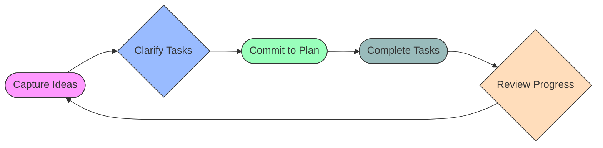

# Project Praxis — Product Doctrine  
## Version 1.0  
## Status: Foundational  
## Last Updated: 2026-03-01  

**Executive Summary:** Praxis is a **planner-first execution system** that helps users translate intentions into consistent completion. It solves the problem of the “execution gap” (when well-formed intentions stall) by enforcing a lightweight daily loop and simple object model.  Its **core loop** (Capture → Clarify → Commit → Complete → Review) is the constitution; optional modules (Studio canvas, insights, gentle gamification) augment but never replace it.  This document defines the product architecture: user archetypes and needs, strategic trade-offs, and system invariants that build on the Core. It establishes scope (what is and isn’t built), metrics (how we measure success), and integration contracts for Design, Frontend, and Backend. All modules must remain **non-negotiable with Core invariants**: autonomy, low friction, fast re-entry after disruption, and no coercion.  

## 1. Inherited Constraints (from Core)  
Praxis’s Product Doctrine **inherits all Core invariants**.  In particular:  
- **Planner-first priority:** The daily planning/execution view is primary. No feature may distract from or block the core flow.  
- **Fast Re-entry:** After any interruption or setback, the system helps users quickly re-engage (“pick up where you left off”)【22†L318-L327】. The system *recovers* users, it never punishes.  
- **Objects-First:** Tasks, Habits, Goals, Projects, and Notes are immutable primitives. All views (Planner, Canvas, lists) reference these objects; none duplicate content.  
- **Optional Overlays:** Insights and Gamification modules are off by default, non-blocking, and removable. They **never** become mandatory for core functionality.  

No feature in Product may violate these core guardrails. Everything built in Product must ultimately reinforce the Core’s mission: **sustained execution of user commitments**.  

## 2. Problem Definition  

Praxis exists because modern knowledge workers face three key challenges:

- **Execution Gap:** People often have clear plans but fail to translate them into action【22†L318-L327】. Complex systems, shifting priorities, and frequent interruptions cause a gap between intention and outcome. (In practice, employees show higher performance when following a prioritized task list, unless constant interruptions derail them【22†L318-L327】.) Our job: minimize friction at each handoff of the execution loop.  

- **Tool Fatigue:** Many productivity tools demand extensive setup or constant tuning. Endless features and customization can lead to “digital overwhelm” or decision paralysis. Each extra dialog or option can derail a user’s flow. Praxis forbids heavy overhead: planning must feel *faster than not planning*.  

- **Motivation Fragility:** Sustaining effort over time is hard (especially with ADHD or executive-function issues【15†L252-L255】). Strict streaks or punitive rewards often backfire, causing burnout or disengagement【11†L185-L192】. Users need encouraging feedback loops without shame or addiction. Praxis must boost intrinsic motivation gently, e.g., celebrating *consistency, not volume*.  

These problems are grounded in behavioral science. For example, one study found that creating a task list and priorities boosts work engagement – but only if interruptions are managed【22†L318-L327】. Another highlights that ADHD-related executive function deficits “adversely” affect a person’s ability to begin, sustain, and complete tasks【15†L252-L255】.  Praxis is designed for these challenges: it channels planning energy into a simple loop and adds supportive overlays only if they truly help.  

## 3. Product Thesis  

Praxis is **a Personal Execution OS**: a lightweight operating system for daily life. It is NOT: a full document system (like Notion), a game engine, or a social network. It *is* a structured planner with optional augmentation modules.  

**Core Thesis:** *Praxis makes good intentions real through disciplined simplicity and consistent reflection.* It prioritizes **action over archiving**. Every feature must either directly support the user completing a real-world commitment or *harvest insight* into their execution patterns. By constraining scope and rewarding progress (quietly), Praxis ensures that every day ends with a sense of accomplishment.  

This is distinct from other tools: unlike a generic note-taking wiki, Praxis *locks in focus* on doing. Unlike a purely gamified app, Praxis does **not** lead with extrinsic rewards. It is an execution tool first, with supportive extras that never overshadow the daily plan.  

## 4. Product Shape Architecture  

Praxis has **two surfaces**: the Planner (Home) and the Studio (Canvas). Together they prevent scope creep and reinforce the object model.

- **Primary Surface – Home (Planner):** This is the default launch screen. It contains Today, Week, Habits, Goals, and Projects (shared contexts). Each is a tightly-scoped execution list or view. For example:
  - **Today:** shows tasks/habits to do today, ordered by priority.
  - **Week:** a 7-day horizon of upcoming commitments.
  - **Habits:** recurring behaviors with easy checkoff (no shame).
  - **Goals:** outcome-driven containers (could be solo or shared).
  - **Projects:** group of tasks shared with others (boards or lists).
  
  *(See “Execution Loop” below for how items flow through these screens.)*  

- **Secondary Surface – Studio (Canvas):** An optional, freeform workspace to visualize relationships among objects. The Canvas never creates new tasks or data; it only lets users layout existing Tasks, Goals, Notes, Projects as nodes and links for brainstorming. Key rules:
  - Canvas items are **pointers** to core objects (Task/Habit/Goal/Note/Project).  
  - The Canvas model only stores layout metadata: positions (x,y), group frames, and connection links.  
  - Nothing on the Canvas is separate content – it cannot hide or delete tasks. This prevents it from evolving into an unbounded wiki.  
  - Mind-Map mode (auto-layout view) is a derived feature, not a separate product.  
  - *Constraint:* The Studio is *never* required for daily planning; it’s an optional space for complex thinking. Users can ignore it if they prefer.  

Both surfaces rely on the same **object model**. All “objects” in Praxis have minimal definitions:

| Object    | Definition                                                      |
|-----------|-----------------------------------------------------------------|
| **Task**  | A single, atomic to-do with a concrete outcome. (Uncompleted tasks appear in Today/Week until done.) |
| **Habit** | A recurring activity pattern (no strict due date; success is checkmark on expected days).            |
| **Goal**  | A multi-step outcome container (can group tasks, but does not enforce task completion order).      |
| **Project**| (Optional) A collaboration context grouping tasks/goals (with role-based permissions).              |
| **Note**  | Freeform text/mind-map content (linked to objects but not a planner list itself).                 |
| **Insight**| (Analytics objects) Discrete findings generated by the Insights module (e.g., “energy level: low”). |
| **Companion** | (Cosmetic) The idle pet/avatar that grows with user consistency (progress tracker, not core). |

*(This table is illustrative; actual schema details live in system docs.)*

### Object Model Summary (Responsibilities)  
- **First-Class Objects:** Tasks/Habits/Goals/Notes/Projects are first-class. They have stable fields (title, description, due dates, links). They support tagging and linking but not open text databases.  
- **Views are Virtual:** All views (Planner lists, Canvas nodes, Board views) render these objects. Edits always update the single source of truth.  
- **Insight & Companion:** These are derivative “objects” stored as progress data (e.g., a Companion’s level is saved, insight capsules log data) but are always optional layers.  

*Design/Frontend/Backend must honor this object model: e.g., the same task ID anywhere, with no dupe.*  

## 5. Execution Loop Specification  

Praxis’s core is a **repeatable daily loop**. In each cycle, the user moves a small set of actions forward. In formal terms:  

1. **Capture (Inbox):** Quickly jot any idea/task as it comes (in under 10s). Inbox is ephemeral; tasks from here are either scheduled or discarded promptly (brain dumping).
2. **Clarify:** Categorize/priority the captured items. Tag them as Today, Later, Delegate, or Delete. The aim is a **minimal Today**: ideally 1–3 clear tasks (based on core’s “capture energy” principle).
3. **Commit (Plan):** The user selects from clarified items those they will actually pursue today/this week. They explicitly pick a small number of **priorities** (to drive motivation). These go into the Today view (as “Commitments”).
4. **Complete (Execute):** Throughout the day, user completes tasks/habits. They may also shift some tasks to Week if not done today. Completed tasks earn immediate feedback (checkmarks, companion XP).  
5. **Review:** At day’s end, the user spends ~60 seconds reviewing. This covers what was done, why tasks moved or didn’t get done, and loosely planning the next day. A simple prompt ensures reflection (e.g., “What went well?” “What needs to move tomorrow?”).  

**Each stage must guard against drop-off:** e.g., if too many tasks accumulate in Inbox, user abandon; if review is skipped, learning stops. The system thus gently reminds or auto-defers tasks to avoid paralysis. Research shows that explicit planning of tasks raises engagement and performance【22†L318-L327】; Praxis institutionalizes that into a ritual.  

## 6. Modules (Optional Layers)  

Praxis’s only official extensions are the **Insights** and **Gamification (Companion)** modules. Both adhere to strict rules: off-by-default, no gating of core, and ethically designed.

### 6.1 Insights Module (Data & Prompts)  

**Purpose:** Help users plan and reflect by surfacing patterns in their data (energy, focus windows, habit success). These are purely optional *suggestions*, not controls.

- **Insight Capsule UX:** If enabled, a small “capsule” appears on Today view summarizing one insight (reading time <10s). E.g., “Your energy was low around noon yesterday; consider scheduling a short break or easier task then.” or “Today’s focus window: 9–11am; try tackling your top priority then.”  
- **Standardized Primitives:** Regardless of esoteric origin (astrology, numerology, human design, biorhythm, etc.), all insights map to fixed fields:  
  - `energy_level` (High/Med/Low)  
  - `focus_window` (time range or context recommended)  
  - `social_window` (time range)  
  - `friction_warning` (concise caution for the day)  
  - `growth_prompt` (motivational quote/goal suggestion)  
  - `review_prompt` (short reflection question)  

  This unifies UI design and data storage, so adding a new system (e.g. a new metaphysical overlay) doesn’t change code structure.  

- **Privacy & Consent:** Insights are **opt-in**. Users must explicitly allow collection of any personal data (birth date, name, etc.). All such data is local or easily deletable. Insight content is private by default (especially in shared projects). We avoid sharing esoteric personal profiles with others without consent.  

- **Apply-to-Plan Interaction:** Insights only **suggest**, never enforce. Example actions: “Your focus window is 10–12 → [Schedule Priority Task at 10am]”, or “Energy low today → [Switch to maintenance habits]”. The user clicks to apply a suggestion; nothing is auto-applied. This respects autonomy (core invariant) and prevents insights from becoming mandatory navigation aids.  

### 6.2 Gamification Module (Companion + Rewards)  

**Purpose:** Encourage regular use and completion via light “gameful” feedback, without pressure or dark patterns.

- **Idle Companion:** The user can enable a small virtual companion (e.g., a plant or pet). The companion “levels up” or changes appearance when the user completes commitments: e.g., daily commits, priorities done, habit streaks, or reviews performed. This is **cosmetic and optional**. It never locks features (no gating an app feature by companion level).  

- **Three-Tier Reward Stack:**  
  1. **Ambient Progress Map:** A heatmap showing days with completed tasks (replaces harsh streak bars). It rewards consistency by highlighting patterns, with humane rules (e.g., skip one day won’t break all progress).  
  2. **Achievement Badges:** Very limited “milestones” (e.g., “Completed first plan”, “Reviewed 7 days”), earned quietly (no public leaderboard). These are purely personal trophies.  
  3. **Companion Growth:** Cosmetic unlocks for the avatar (new colors, skins). Some idle animation (e.g., blooming flower). These serve as gentle positive feedback without any gameplay loop.  

- **Anti-Gaming Guardrails:** We avoid common pitfalls (negative study results【11†L185-L192】):  
  - **Limit XP/Rewards per Day:** Prevent users from gaming quantity over quality. No super-fast XP farming.  
  - **Favor Planned Over To-Do Mass Completion:** Only tasks that were in Today’s plan yield normal rewards. Unplanned task dumps yield little extra bonus.  
  - **“Grace” via Reflection:** Encourage review by giving slight extra points for completing the Review step, not via spending money or losing streaks.  
  - **No Leaderboards or Social Comparison:** Social or competitive mechanics are explicitly out of scope (core anti-feature).  

The guiding principle: *“quiet dopamine”*. Rewards are subtle, ambient, and always supplement the core feeling of accomplishment, not replace it【11†L185-L192】.  

## 7. MVP / V1 / V2 Scope Boundaries  

To prevent scope creep, we clearly define what is built in each phase. 

| Component               | MVP (v1)                           | V1+ (next) / V2+                        |
|-------------------------|------------------------------------|-----------------------------------------|
| **Planner (Today View)**| Priorities list (max 3/day), basic habits, simple inbox, review prompt | Add schedule strip (time blocks); refine priority algorithms; natural language input   |
| **Week & Goals**        | Drag tasks to days; simple goal container | Calendar integration; goal progress charts  |
| **Studio (Canvas)**     | Infinite canvas; drag/link tasks/notes; basic frames; image/PDF export | Mind-map auto-layout; pre-built templates; real-time collab  |
| **Insights**            | Daily capsule (e.g., astrology-based) mapped to primitives; profile import | Additional systems (numerology, Human Design); mobile notifications; deeper analytics |
| **Gamification**        | Companion avatar; heatmap; simple badges; review bonus | Enhanced avatar customization; seasonal challenges (opt-in); extended habit streak logic |
| **Collaboration**       | Project sharing (view/edit lists)   | Comments on tasks; shared canvas; permissions management |
| **Offline/Sync**        | Local storage; basic cloud sync    | Robust offline (edit anywhere); conflict resolution; cross-device sync |
| **Permissions/Security**| Email auth; per-project visibility | Enterprise SSO; end-to-end encryption (if needed) |

*(Details to be finalized in design docs.)*

**Locked (Must-Have):** By v1, we **must** implement the Core loop on Today, Canvas basics, insight capsule, and companion with guardrails. Without them, the product is incomplete.  

**Deferred (Out-of-Scope for v1):** We **explicitly exclude** features that risk “everything app” creep: a full Notion-like doc editor, mandatory long questionnaires, heavy RPG mechanics (XP shops, currencies), or forcing any module on users. Even collaborative canvases or advanced analytics can wait until the Core is proven stable.  

This roadmap prevents dilution of focus and ensures a clean launch that stays true to the Core philosophy.  

## 8. Success Metrics (North Star & KPIs)  

Metrics quantify our thesis: user is consistently executing plans. We use straightforward formulas (to be tracked via analytics):

- **Weekly Completion Rate (North Star):**  
  \[
    \text{Weekly Completion Rate} = \frac{\text{Tasks Completed in Week}}{\text{Tasks Planned in Week}} \times 100\%
  \]  
  This measures how well plans turn into done work. A high rate (e.g. > 70%) indicates the loop is working. Research suggests even small increases here correlate with engagement【22†L318-L327】.  

- **Activation Rate:** (onboarding success)  
  \(\frac{\text{Users who create 3+ plans in first week}}{\text{New sign-ups}}\).  
  (Goal: high percentage, e.g. >50% by Day 7.)  Some industry benchmarks: Day-1 retention ~33% for productivity apps, Day-30 ~10%【13†L162-L170】. We’ll target exceeding those via quick time-to-value.  

- **DAU/MAU Ratio:**  
  \(\text{DAU/MAU} = \frac{\text{7-day active users}}{\text{30-day active users}}\).  
  A healthy product sees 25–30% (as a rough benchmark from consumer apps【13†L162-L170】).  >25% suggests habit formation.  

- **Review Frequency:** (core loop adherence)  
  \(\frac{\text{Days user completes end-of-day review}}{\text{Days active}}\times100\%\).  
  (Goal: >50% of active days.) Completion of the Review step is a strong signal of loop closure.  

- **Re-entry Success Rate:** (resilience metric)  
  \(\frac{\text{Users who re-plan after a break}}{\text{Users who took a >3-day break}}\).  
  Measures how often a user picks up planning again (goal: as high as possible). Users with ADHD often struggle to restart, so we aim for >50% coming back within a week of break【15†L252-L255】.  

Explicit formulas and tracking ensure quantitative grounding. We will also track qualitative feedback (e.g., via onboarding surveys) to catch issues raw numbers may miss.  

## 9. Anti-Features (Explicit Prohibitions)  

These are *forbidden by our constitution*:

- **No Mandatory Philosophy Drills:** Users are never forced to complete tutorials about the Core method. (If they opt in, fine; otherwise the app starts at Today instantly.)  
- **No Distraction Overlays:** We will not introduce social feeds, ads, or unrelated content. The app does *one thing: help you do your to-dos*.  
- **No Over-Configurable Schemas:** Under no circumstances should the user have to build custom databases or an “object type” to use the app effectively. We stick to our minimal model.  
- **No Punitive Streaks or Dark Patterns:** Breaking a streak never causes penalty beyond losing the streak itself. There’s no monetization that traps core features behind paywalls.  
- **No Irreversible Automation:** Praxis will never auto-delete or auto-reschedule tasks without user consent. (Safety rule from Core.)  

Each anti-feature protects user autonomy and the focus on execution.  

## 10. Failure Modes & Edge Cases  

We must anticipate how users can go off the rails. Some expected failure scenarios:  
- **Zero Tasks Scenario:** If a user enters an empty plan, show encouraging prompts (e.g. “Add any loose tasks or goals – this session only takes 30 seconds!”). Don’t punish.  
- **Plan Overflow:** If tasks backlog beyond today, the system should auto-suggest moving lower-priority tasks to later days, or archiving old tasks. Avoid interface “hanging”.  
- **Interruption & Recovery:** If a user had a long break (illness, vacation), on login we surface a “Recovery Plan” prompt (e.g. “Welcome back! Would you like to revive last week’s plan?”). This is validated by research that short mental breaks improve efficiency【22†L318-L327】; we bake that in by design.  
- **Shared Project Conflict:** (if collaboration exists) Version conflicts are resolved conservatively (last write warning) and require manual merge, not auto-overwrite. Tasks completed by one user should reflect immediately to avoid duplication.  
- **Insight Mismatch:** If an insight contradicts user experience (e.g., system says “High energy” but user feels burnt out), allow user to flag or override it. Never force insight into behavior.  

We will test these scenarios in user studies. The goal is to have a graceful “plan B” for every breakdown mode.  

## 11. Alignment Contracts  

To keep layers in sync, we define how Design, Frontend, and Backend must interpret this doctrine:

- **Design Team:** Should express the core loop visually as simply as possible. For example, Today/Priorities view must load in <1s and use high-contrast focus on the top 3 tasks (aligning with “fast re-entry”). The Canvas UI should never hide the Planner route. Design tokens and components must align with the autonomy ethos: e.g., modals should be cancellable, and progress visuals must have an “off” state. In practice, design comps should label which elements are optional (Insights badge, companion icon) so engineering can treat them as widgets.  

- **Frontend Engineering:** Must treat “Planner route” (Today/Week/Habits/Goals) as the primary route. It should prefetch data for Today on app launch to avoid blank states. The Studio route may be a separate code bundle (since some users will never use it). Frontend must enforce offline resilience on core views: Today and inbox should work fully offline and sync later, because capture must never block. Insights computations, if heavy, can be deferred or done in the cloud, but should not block user flow.  

- **Backend Engineering:** Must define a flat task schema (no polymorphic per project). For example, every object has a unique global ID, so dragging a task into a Project simply sets a `project_id` on it. There should be no “Project-Todo” join tables with different fields — we keep one task table with project columns. Review and Insight data are logged but should be auditably separate from personal fields (for privacy). Collaboration permissions should live at the object level (isEditable flag) to align with the optional nature of share. Performance-wise, queries for Today view must be optimized (e.g., separate table or index for `due_date = today`).  

Each layer’s roadmap should reference this document’s sections. For example, Design specs should mention “See Product Doctrine §5 for execution flow” and Frontend tickets should note “enforce no more than 3 priorities per day (Product §8).” This way the Product Doctrine remains the single source of truth for product-level rules.  

---

**Final Note:** This Product Doctrine is binding. Future feature proposals must refer back to its constraints and priorities. Where something is “unspecified” here (e.g. exact scoring of companion XP), decisions must still respect the spirit: simplicity, user control, and alignment with Core. By adhering to these guidelines, we ensure Praxis grows as a cohesive system, not a random assortment of features.

