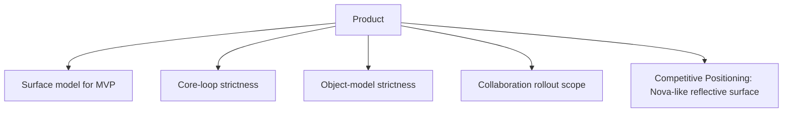
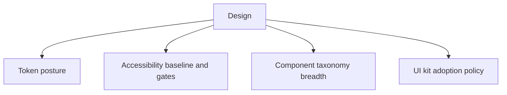
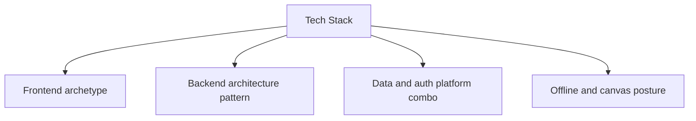

# Project Praxis - Decision Tree Mindmap

Purpose: decision-ready map for Product, Design, and Tech Stack choices.  
Source doctrine: `docs/constitution/01-core.md` to `docs/constitution/05-backend.md`.

## Product trunk

### P1) Surface model for MVP
- Decision question: Do we ship Planner-only MVP or Planner plus minimal Studio?
- Options:
  - A: Planner-only MVP.
  - B: Planner + minimal Studio pointers.
  - C: Full dual-surface day one.
- Tradeoffs:
  - A: fastest and focused; delays Studio validation.
  - B: balanced validation; moderate complexity.
  - C: richer vision test; highest delivery and UX risk.
- Recommended evaluation method: Prototype plus 5-user workflow test.
- Evidence: `docs/constitution/02-product.md`, `docs/constitution/04-frontend.md`.

### P2) Core-loop strictness
- Decision question: How strongly should UI enforce Capture -> Clarify -> Commit -> Complete -> Review?
- Options:
  - A: Hard sequence gates.
  - B: Guided prompts with soft exits.
  - C: Freeform navigation with optional loop widgets.
- Tradeoffs:
  - A: consistency and metrics clarity; lower flexibility.
  - B: strong defaults with user agency; requires careful microcopy.
  - C: flexible power-user flow; weaker loop adherence.
- Recommended evaluation method: Usability test focused on loop completion and re-entry.
- Evidence: `docs/constitution/01-core.md`, `docs/constitution/02-product.md`.

### P3) Object-model strictness
- Decision question: How strict is the object model in MVP?
- Options:
  - A: Strict first-class objects only.
  - B: First-class objects plus limited custom fields.
  - C: User-defined object types.
- Tradeoffs:
  - A: high consistency and lower drift; less customization.
  - B: moderate flexibility; adds schema governance work.
  - C: high flexibility; strong risk of everything-app sprawl.
- Recommended evaluation method: Schema spike and ADR.
- Evidence: `docs/constitution/01-core.md`, `docs/constitution/02-product.md`.

### P4) Collaboration rollout scope
- Decision question: What collaboration level belongs in near-term scope?
- Options:
  - A: Solo-first MVP only.
  - B: Role-based sharing in V1.
  - C: Realtime co-editing in MVP.
- Tradeoffs:
  - A: lowest risk; no shared-workflow validation.
  - B: validates practical sharing; manageable complexity.
  - C: strongest collaboration signal; high auth/permission/conflict risk.
- Recommended evaluation method: Permissions spike plus threat model review.
- Evidence: `docs/constitution/02-product.md`, `docs/constitution/05-backend.md`.

### P5) Competitive Positioning: Nova-like Reflective Surface
- Decision question: Should Praxis adopt a Nova-style reflection flow?
- Explicit evaluation questions:
  - Should Praxis adopt any Nova-like reflective surface?
  - If yes, where in the loop should it live?
  - What tradeoffs are acceptable for focus, accountability, and complexity?
- Options:
  - A: Integrate reflective prompts into Review only.
  - B: Add a separate Reflection mode/surface in addition to Review.
  - C: Do not adopt Nova-like reflection patterns.
- Tradeoffs:
  - A: preserves object-first loop and adds emotional support where reflection already exists; requires careful prompt design.
  - B: may improve engagement and onboarding meaning; risks feed-like drift and surface sprawl.
  - C: protects execution purity; misses emotional UX improvements that can improve return behavior.
- Recommended evaluation method: Review-phase prototype A/B test plus 2-week retention/re-entry cohort readout.
- Evidence: `docs/constitution/01-core.md`, `docs/constitution/02-product.md`, [Nova](https://nova.lightmode.io/).

## Design trunk

### D1) Token posture
- Decision question: Do we enforce semantic token architecture from day one?
- Options:
  - A: DTCG-aligned semantic tokens now.
  - B: Semantic tokens in internal format first.
  - C: Raw CSS variables without token governance.
- Tradeoffs:
  - A: best portability and long-term rigor; higher setup cost.
  - B: faster start; future migration overhead.
  - C: fastest initial styling; highest drift risk.
- Recommended evaluation method: Two-theme token pipeline spike.
- Evidence: `docs/constitution/03-design.md`, `docs/constitution/04-frontend.md`, [DTCG Draft Spec](https://www.designtokens.org/TR/drafts/)

### D2) Accessibility baseline and gates
- Decision question: Which accessibility bar is release-blocking?
- Options:
  - A: WCAG 2.2 AA with CI checks.
  - B: WCAG 2.2 AA manual audit only.
  - C: Accessibility uplift after MVP.
- Tradeoffs:
  - A: highest quality and risk control; more up-front discipline.
  - B: lower automation burden; audit coverage gaps.
  - C: faster short-term shipping; high remediation and trust risk.
- Recommended evaluation method: Axe scans plus keyboard walkthrough acceptance.
- Evidence: `docs/constitution/03-design.md`, `docs/constitution/04-frontend.md`, [WCAG 2.2](https://www.w3.org/TR/WCAG22/)

### D3) Component taxonomy breadth
- Decision question: How broad is the MVP component taxonomy?
- Options:
  - A: Lean core taxonomy for Planner-first flows.
  - B: Full taxonomy from doctrine.
  - C: Kit-driven ad hoc taxonomy.
- Tradeoffs:
  - A: fast implementation; future expansion work.
  - B: fewer later gaps; slower to build.
  - C: rapid prototype output; weak consistency and ownership.
- Recommended evaluation method: Component inventory and implementation estimate.
- Evidence: `docs/constitution/03-design.md`, [UI Guideline Components](https://www.uiguideline.com/components), [Component Gallery Components](https://component.gallery/components/)

### D4) UI kit adoption policy
- Decision question: How should external kits be used?
- Options:
  - A: Kits for exploration only; production from Praxis components.
  - B: Kits as production base.
  - C: No kits at all.
- Tradeoffs:
  - A: fast exploration without lock-in; requires component build investment.
  - B: fastest production startup; identity and maintenance lock-in risk.
  - C: strongest ownership purity; slower design throughput.
- Recommended evaluation method: Design sprint A/B with two critical Planner workflows.
- Evidence: `docs/constitution/03-design.md`, [UI Guideline Kits](https://www.uiguideline.com/kits)

## Tech stack trunk

### T1) Frontend archetype
- Decision question: Which frontend framework archetype best fits Praxis constraints?
- Options:
  - A: Next.js server-first React.
  - B: Remix progressive enhancement.
  - C: SvelteKit compiler-led.
- Tradeoffs:
  - A: strong ecosystem and fullstack path; caching complexity.
  - B: robust web fundamentals; less standardization for complex app state.
  - C: responsive bundles and DX; higher adoption/hiring risk for React-first teams.
- Recommended evaluation method: Vertical slice benchmark on Planner route.
- Evidence: `docs/constitution/04-frontend.md`.

### T2) Backend architecture pattern
- Decision question: Which backend structure should we start with?
- Options:
  - A: Modular monolith.
  - B: Serverless-first composition.
  - C: Early microservices.
- Tradeoffs:
  - A: fastest coherent start; requires good module boundaries.
  - B: lower ops at start; potential vendor/runtime constraints.
  - C: scalability isolation; large coordination and observability overhead.
- Recommended evaluation method: Complexity and operability scoring spike.
- Evidence: `docs/constitution/05-backend.md`.

### T3) Data and auth platform combo
- Decision question: Which data and identity stack gives best reliability versus lock-in?
- Options:
  - A: Postgres + ORM + managed auth provider.
  - B: Supabase integrated stack.
  - C: Firebase Firestore + Firebase Auth.
- Tradeoffs:
  - A: strongest portability and SQL flexibility; more integration work.
  - B: fast integrated delivery; ecosystem coupling risk.
  - C: rapid realtime/offline primitives; query constraints and lock-in.
- Recommended evaluation method: Auth plus row-level-permission proof-of-concept.
- Evidence: `docs/constitution/05-backend.md`.

### T4) Offline and canvas posture
- Decision question: What is the right sequence for offline resilience and Studio canvas?
- Options:
  - A: Offline queue first; canvas minimal in V1.
  - B: Offline minimum and canvas MVP now.
  - C: Online-first Planner now; offline and canvas later.
- Tradeoffs:
  - A: protects Planner reliability; slower canvas ambition.
  - B: validates both promises early; higher execution risk.
  - C: fastest path to basic release; weak fast re-entry guarantee.
- Recommended evaluation method: Offline replay spike plus canvas performance spike.
- Evidence: `docs/constitution/04-frontend.md`, `docs/constitution/05-backend.md`.
